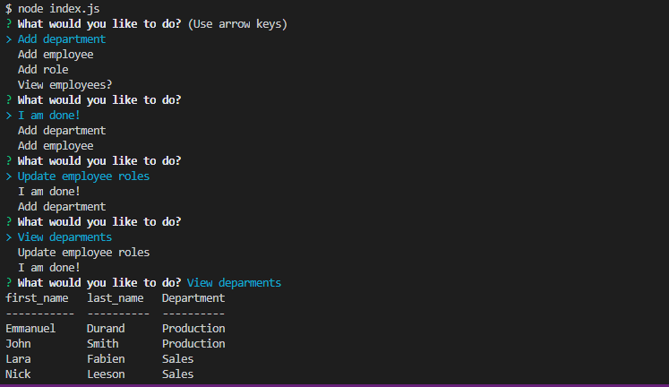

# MySQL_Employee_Tracker

# TemplateEngine-EmployeeSummary

This application is a solution for managing a company's employees using node, inquirer, and MySQL.
  
* [Installation](#Installation)
  
* [Instructions](#Instructions)
  
* [License](#License)
  
* [Author](#Author)

  ## Installation

  Using Terminal on Visual Studio Code.

  ## Instructions
  
  On VS, open terminal and type `npm install`. In MySQL type "Source db/schema.sql" then "Source db/seeds.sql". After exiting MySQL, type "node index.js". 
 
  ## License 
  
  This project is licensed under the MIT license
  
  ### Terminal Screen Shot
  
  
  ## Author 
  
**manu-austin**
  
Email: shernua@gmail.com
